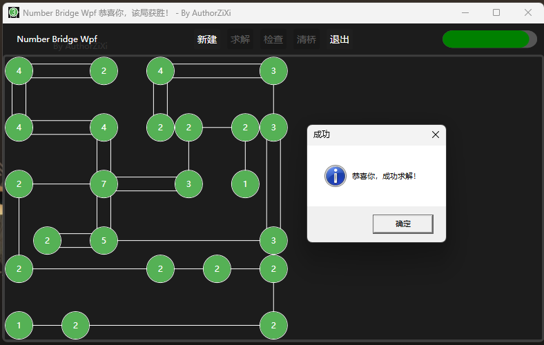

# NumberBridgeWpf

“简单的”数桥游戏，用`C#+wpf`制作。

界面预览：

**使用 MIT LICENSE**

下载在 Releases

Avalonia的版本太大了，不一定能上传成 Releases。

如果需要编译的Android版apk

请在 [【123 盘 (我没有会员，请登录下载)】](https://www.123912.com/s/Qpm8Vv-OFisH) 下载

## 项目组成

- NumberBridge : 核心游戏逻辑，包括地图生成，桥梁连接，相关判断
- NumberbridgeConsole : 地图生成测试，无游戏功能
- NumberBridgeWpf : 游戏程序，交互与地图转换
- NumberBridgeAvalonia : NumberBridgeWpf 的 Avalonia 版本
	- NumberBridgeAvalonia.Desktop : 桌面版
	- NumberBridgeAvalonia.Android : Android 移动版

> 注意: 
>
> PutGame.cs 在 `NumberBridgeWpf` 是将地图数据转换成控件交互的方法类，但 `NumberbridgeConsole` 是地图转换成控制台文本的方法类

> 额外提醒 (25.2.22 更新)
>
> 对了，我的项目都是趋于兴趣做的，如果有bug也难免，需要与我联系请先看主页近期概况，很有可能没有时间答复。（比如学业
>
> 目前时期状况： 本来我的周末就不完整（周六中午左右放，周日下午走。还有作业，很繁忙，抽空更新开发项目都不错了，希望各位不要刁难我 😇
## 开发历程与心得

- 一切的开始

24年时，偶然得知数桥谜题，了解游戏规则后，有了开发的写法

- 25.1.27 开始制作

在制作过程期间，多次使用搜索，还是发现没人`用除js以外的语言`做这类游戏。

网上有的基本上也是`html+js`写的，没有开放任何有用的源代码

我仅凭兴趣去开发了这个程序，代码质量不能保证。

- 25.1.28 基础地图生成逻辑

参见 `NumberBridgeGamePanel实例.CreateBaseMap()` 

- 25.1.29 基础地图生成逻辑完成

- 25.1.30 完成并打包Setup

包括正常的谜题地图随机生成，求解，游玩功能

- 25.2.22 完成 NumberBridgeAvalonia

真不是我说从wpf尝试移植到Avalonia上面真是麻烦，不仅部分属性声明改变了，控件样式自定义都有很大不同。

花了一个下午，写这个的时间是22:34左右。

android端开发挺费劲的，无法打断点，编译时间巨长(安卓端要编译两轮80个库)。

window端也是遇到了对话框问题，avalonia没有对话框，需要社区库，我使用了`MessageBox.Avalonia`。

为了适配多端界面稍微改了布局，已知且不会解决的问题是`SelectSizeDialogControl`背景透明，由于没找到获取主题背景色的方法所以只能这样了。

因为需要单页应用支持所以将这个对话框内置成控件了

avalonia这个库是真大，相比wpf版，大了几十倍。

本来想整个网页版的，在官方存储库也搜了这个默认模板出现avalonia.js丢失的问题，没有解决就算了。

